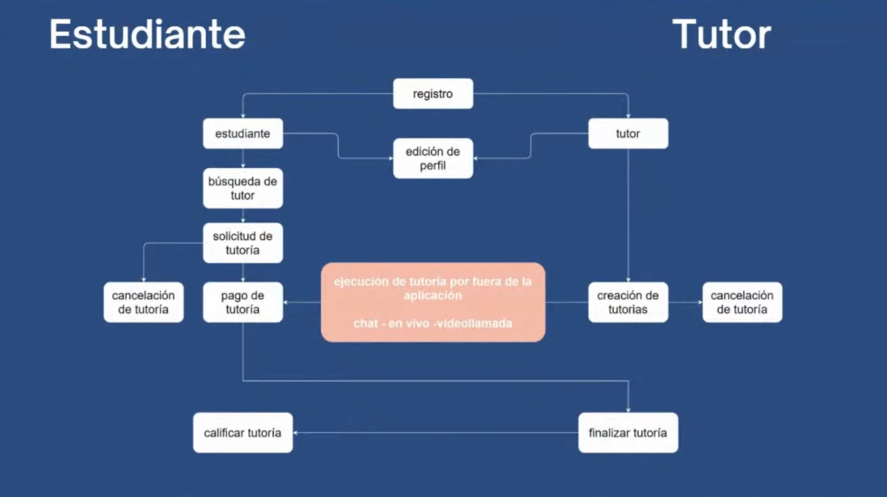
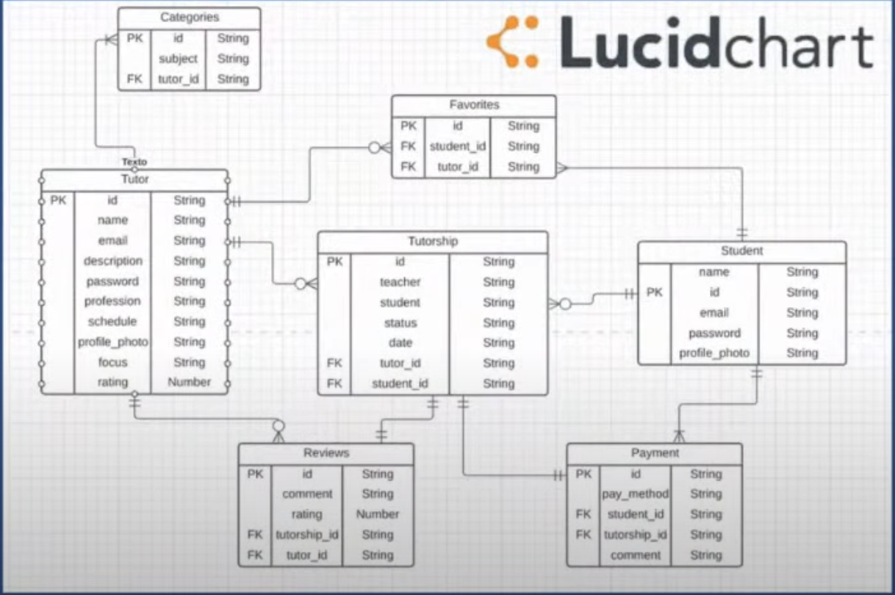

# Agora tutorships

## Problema
Hoy en  dia, los estudiantes de universidades y colegios tienen dificultades para encontrar tutores que les puedan ayudar con sus materias. Por otro lado, los tutores tienen dificultades para encontrar estudiantes que necesiten de su ayuda.

## Descripción
Agora tutorships es una plataforma que conecta a estudiantes con tutores para resolver una duda puntual sobre un tema específico. Los estudiantes pueden buscar tutores por materia y el tutor puede ofrecer sus servicios por materia. Los estudiantes pueden calificar a los tutores y los tutores pueden calificar a los estudiantes.

## Tecnologías

### Frontend
- React
- Redux
- React Router
- Axios
- Font Awesome
- Sass (SCSS)
- SweetAlert2
- lottiefiles

### Backend
- Node.js
- Express
- MongoDB
- Mongoose
- JWT
- Bcrypt
- SendGrid
- Epayco

### Database

## El trabajo que te toca hacer

El proyecto es un MVP que ya está terminado, pero hay algunas funcionalidades que no están implementadas y existen algunas desiciones tecnicas que no fueron las mas acertadas. Tu trabajo es implementar las siguientes funcionalidades:

- [ ] Crear un repositorio en GitHub para cada uno de los proyectos (client y server). Este repositorio debe ser publico y debe tener como colaboradores a los instructores del curso. El nombre del repositorio debe ser `agora-tutorships-<client o server>`.
- [ ] Ejecutar el proyecto en tu computador y familiarizarte con el código.
- [ ] Adicionar reglas de ESLint al proyecto (airbnb, standarjs) y correr el linter para que el codigo siga esas reglas.
- [ ] Aplicar i18n (multiples idiomas).
- [ ] Agregar filtros de busqueda al cliente.
- [ ] Migrar sistema de pagos a Stripe.
- [ ] Migrar uso de redux a redux-toolkit.
- [ ] Modificar la carga de imagenes desde el backend haciendo uso de la libreria multer
- [ ] Agregar sistema de chat para que los estudiantes y tutores puedan comunicarse (websockets).
- [ ] Calendarios y gestion automática de citas.
- [ ] Realizar las videosllamadas dentro de la plataforma (webRTC).
- [ ] Edicion de fotos de perfil.

Sientete libre de agregar cualquier funcionalidad que creas que pueda mejorar la experiencia de usuario.
