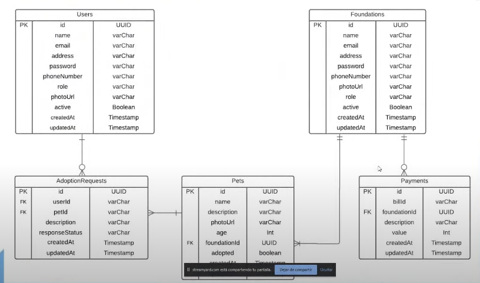

# Adogta

## Problema
- Los tramites presencales para adopcion de mascotas son muy largos y tediosos.
- Fundaciones y protectoras no tienen un sistema para gestionar las adopciones de sus mascotas.
- Los dueños de mascotas no tienen un sistema para gestionar las adopciones de sus mascotas.

## Descripción
Adogta es una plataforma que conecta a fundaciones con personas que quieren adoptar una mascota con el fin de facilitar la experiencia de adopcion. Las fundaciones pueden publicar sus mascotas para que sean adoptadas y las personas que quieren adoptar una mascota pueden buscar mascotas disponibles. Las fundaciones pueden calificar a las personas que adoptaron sus mascotas y las personas que adoptaron una mascota pueden calificar a los fundaciones.

- [Link](https://top-app-six.vercel.app/)

## Tecnologías

### Frontend
- React
- Redux
- React Router
- Axios
- React Scroll, React Table, React Form
- Font Awesome
- Css vanilla
- SweetAlert2
- lottiefiles

### Backend
- Node.js
- Express
- MongoDB
- Mongoose
- JWT
- Bcrypt
- SendGrid
- Epayco

### Database

## El trabajo que te toca hacer

El proyecto es un MVP que ya está terminado, pero hay algunas funcionalidades que no están implementadas y existen algunas desiciones tecnicas que no fueron las mas acertadas. Tu trabajo es implementar las siguientes funcionalidades:

- [ ] Crear un repositorio en GitHub para cada uno de los proyectos (client y server). Este repositorio debe ser publico y debe tener como colaboradores a los instructores del curso. El nombre del repositorio debe ser `adogta-<client o server>`.
- [ ] Ejecutar el proyecto en tu computador y familiarizarte con el código.
- [ ] Adicionar reglas de ESLint al proyecto (airbnb, standarjs) y correr el linter para que el codigo siga esas reglas.
- [ ] Implementar una pagina que muestre la lista de todas las fundaciones registradas en el sistema, ademas de un buscador para filtrar las fundaciones por nombre.
- [ ] Adicionar una pagina de detalle por cada fundacion donde se listen las diferentes mascotas que tienen para adoptar.
- [ ] Mostrar en el perfil del usuario el estado de la solicitud de adopcion.
- [ ] Aplicar i18n (multiples idiomas).
- [ ] Implementar un sistema de comentarios y de Likes (❤️) para los detalles de las mascotas.
- [ ] Migrar sistema de pagos a Stripe.
- [ ] Migrar uso de redux a redux-toolkit.
- [ ] Modificar la carga de imagenes desde el backend haciendo uso de la libreria multer

Sientete libre de agregar cualquier funcionalidad que creas que pueda mejorar la experiencia de usuario.
