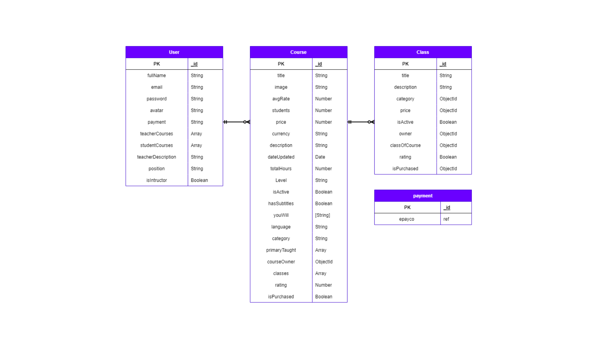

### Udemy Clone

## Descripción

Udemy es una plataforma de aprendizaje en línea mediante cursos de temas específicos con la posibilidad de ser maestro o estudiante. Si eres maestro puedes subir cursos y si eres estudiante puedes comprar cualquier curso.

## Video presentación

https://youtu.be/Mdq2s9HLf00?list=PLxyfMWnjW2ktsDlYU7KVJltXGfHvXVGBE&t=1377

## Tecnologías

### Frontend

- React
- React Router
- SASS
- Redux
- Axios
- hello-pangea/dnd → drag and drop

### Backend

- Node
- Express
- Mongoose
- MongoDB
- bcrypt
- busboy
- morgan
- dotenv
- cors
- nodemailer
- cloudinary
- jsonwebtoken

## Database

## El trabajo que te toca hacer

El proyecto es un MVP que ya está terminado, pero hay algunas funcionalidades que no están implementadas y existen algunas desiciones tecnicas que no fueron las mas acertadas. Tu trabajo es implementar las siguientes funcionalidades:

- [ ] Crear un repositorio en GitHub para cada uno de los proyectos (client y server). Este repositorio debe ser publico y debe tener como colaboradores a los instructores del curso. El nombre del repositorio debe ser `udemy-<client o server>`.
- [ ] Ejecutar el proyecto en tu computador y familiarizarte con el código (debes buscar las variables de entorno necesarias para poder ejecutar tu código).
- [ ] Adicionar reglas de ESLint al proyecto (airbnb, standarjs) y correr el linter para que el codigo siga esas reglas.
- [ ] Migrar react a next.js
- [ ] Cambiar plataforma de envío de correos de nodemailer a sendgrid
- [ ] Mejoras experiencia en página para de agregar cursos
- [ ] Completar flujo de usuario estudiante
- [ ] Implementar carrito de compras y persistir los datos es una entidad en base de datos
- [ ] Cambiar pasarela de pagos de Epayco a Stripe
- [ ] Documentar back de cualquier forma, preferiblemente swagger ó notion
- [ ] Agregar sistema de chat para que los estudiantes y tutores puedan comunicarse (websockets).
- [ ] Migrar uso de redux a redux-toolkit.
- [ ] Modificar la carga de imagenes desde el backend haciendo uso de la libreria multer.
