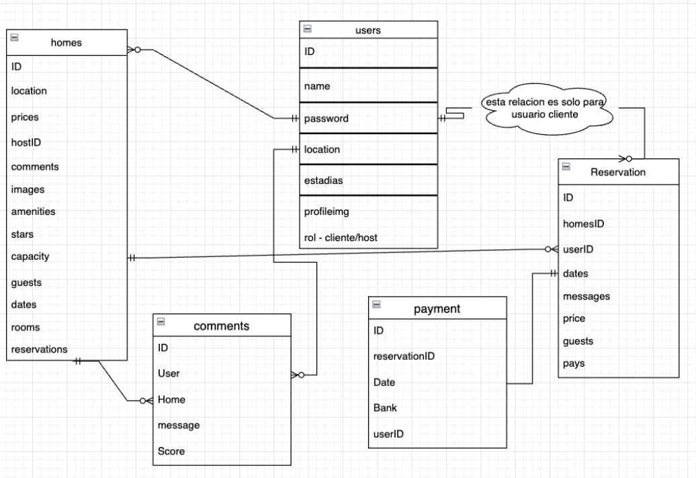

### Airbnb clone

## Descripción

El airbnb es una plataforma de alquiler de viviendas, apartamentos y habitaciones. Los usuarios pueden buscar y reservar alojamiento en más de 190 países.

## Video presentación

https://youtu.be/Mdq2s9HLf00?list=PLxyfMWnjW2ktsDlYU7KVJltXGfHvXVGBE&t=3170

## Tecnologías

### Frontend

- React
- React Router
- SASS
- Redux
- Axios
- Mantine
- sweetalert2
- Places API
- Maps javascript API
- Geocoding API

### Backend

- Node
- Express
- Mongoose
- MongoDB
- bcrypt
- busboy
- morgan
- dotenv
- cors
- nodemailer
- cloudinary
- jsonwebtoken

## Database

## El trabajo que te toca hacer

El proyecto es un MVP que ya está terminado, pero hay algunas funcionalidades que no están implementadas y existen algunas desiciones tecnicas que no fueron las mas acertadas. Tu trabajo es implementar las siguientes funcionalidades:

- [ ] Crear un repositorio en GitHub para cada uno de los proyectos (client y server). Este repositorio debe ser publico y debe tener como colaboradores a los instructores del curso. El nombre del repositorio debe ser `airbnb-<client o server>`.
- [ ] Ejecutar el proyecto en tu computador y familiarizarte con el código (debes buscar las variables de entorno necesarias para poder ejecutar tu código).
- [ ] Adicionar reglas de ESLint al proyecto (airbnb, standarjs) y correr el linter para que el codigo siga esas reglas.
