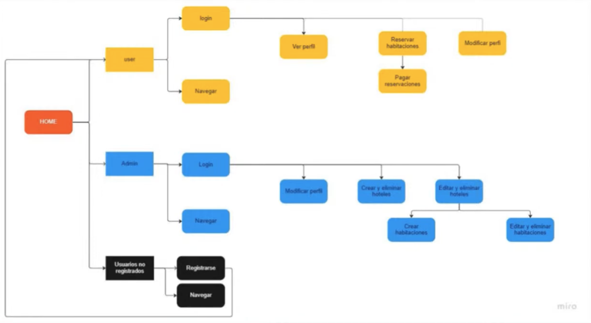

# Hotel Booking

## Problema
- Los tramites presencales para adopcion de mascotas son muy largos y tediosos.
- Fundaciones y protectoras no tienen un sistema para gestionar las adopciones de sus mascotas.
- Los dueños de mascotas no tienen un sistema para gestionar las adopciones de sus mascotas.

## Descripción
La aplicación le permite a los usuarios buscar y reservar alojamientos que publican los administradores del sistema. Los usuarios pueden buscar alojamientos por ciudad, fecha de entrada y fecha de salida. Los administradores pueden publicar alojamientos y ver las reservas que se han hecho.

## Tecnologías

### Frontend
- React
- Redux
- React Router
- Axios

### Backend
- Node.js
- TypeScript
- Express
- MongoDB
- Mongoose
- JWT
- Bcrypt
- SendGrid
- Stripe

### Database

## El trabajo que te toca hacer

El proyecto es un MVP que ya está terminado, pero hay algunas funcionalidades que no están implementadas y existen algunas desiciones tecnicas que no fueron las mas acertadas. Tu trabajo es implementar las siguientes funcionalidades:

- [ ] Crear un repositorio en GitHub para cada uno de los proyectos (client y server). Este repositorio debe ser publico y debe tener como colaboradores a los instructores del curso. El nombre del repositorio debe ser `adogta-<client o server>`.
- [ ] Ejecutar el proyecto en tu computador y familiarizarte con el código.
- [ ] Adicionar reglas de ESLint al proyecto (airbnb, standarjs) y correr el linter para que el codigo siga esas reglas.
- [ ] Aplicar i18n (multiples idiomas).
- [ ] Crear un sistema de reseñas para los alojamientos.
- [ ] Enviuar un correo electronico a los usuarios con la informacion de su reserva.
- [ ] Funcionalidad para que los usuarios guarden sus metodos de pago.
- [ ] Usar diferentes divisas para los precios de los alojamientos.

Sientete libre de agregar cualquier funcionalidad que creas que pueda mejorar la experiencia de usuario.
